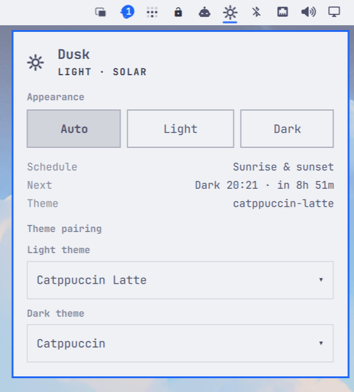

# Dusk



Automatically switch your complete Omarchy desktop between light and dark
themes. Dusk follows sunrise and sunset when location data is available, falls
back to a schedule when it is not, and always applies changes through Omarchy's
native `omarchy theme set` path.

## Why Dusk

- Changes the whole desktop, not just a wallpaper or color scheme.
- Uses solar time from Omarchy's existing weather location, with configurable
  scheduled fallback times.
- Runs independently as a `systemd --user` service, so switching continues
  while the shell is restarted.
- Includes an optional bar widget for switching between Automatic, Light, and
  Dark modes without opening a terminal.
- Leaves Omarchy's themes, current-state files, and application configuration
  under Omarchy's ownership.

## Install

Dusk is a standard Omarchy shell plugin — install it the Omarchy way. There
are no scripts to clone or run:

```sh
omarchy plugin add https://github.com/mrpbennett/qs-dusk.git --enable
```

`omarchy plugin add` clones Dusk into
`~/.config/omarchy/plugins/mrpbennett.dusk`, validates its manifest, and
enables the bar widget. The first time the widget loads it installs the rest
of itself, so nothing else is needed:

- symlinks the `omarchy-auto-theme` and `dusk-scheduler` commands into
  `~/.local/bin`,
- writes the `dusk.service` user unit, which runs the scheduler straight from
  the plugin folder with your graphical session, and
- starts the daemon.

Everything runs from the plugin folder, so `omarchy plugin update` keeps the
entire extension current. The widget shows the current appearance in the bar
and lets you switch Automatic / Light / Dark modes from the panel.

Then choose your themes and mode:

```sh
# Choose the themes to use. List available slugs with: omarchy theme list
omarchy-auto-theme themes --light catppuccin-latte --dark catppuccin

# Follow your Omarchy weather location's sunrise and sunset.
omarchy-auto-theme solar
```

## Choose a Mode

```sh
# Automatic, driven by sunrise and sunset.
omarchy-auto-theme solar

# Automatic, driven by local wall-clock times.
omarchy-auto-theme scheduled --light 07:00 --dark 19:00

# Apply one appearance and pause automatic switching.
omarchy-auto-theme manual light
omarchy-auto-theme manual dark
```

Use `omarchy-auto-theme status` to see the selected mode, current theme, next
transition, and any solar fallback reason.

### Keybindings

To switch modes from the keyboard, add these to `~/.config/hypr/bindings.lua`:

```lua
o.bind("SUPER + SHIFT + ALT + Z", "Dusk: Auto mode", "omarchy-auto-theme solar")
o.bind("SUPER + SHIFT + ALT + L", "Dusk: Light mode", "omarchy-auto-theme manual light")
o.bind("SUPER + SHIFT + ALT + D", "Dusk: Dark mode", "omarchy-auto-theme manual dark")
```

`SUPER + SHIFT + ALT + Z` avoids conflicts with stock Omarchy bindings.

## How It Works

1. The CLI saves your theme pair and scheduling preferences to Dusk's config.
2. The `dusk.service` scheduler determines the desired appearance from the
   selected mode: sunrise/sunset, fixed local times, or a manual choice.
3. Before changing anything, it compares the desired theme with Omarchy's
   current theme state, avoiding unnecessary theme applications.
4. When a change is needed, it runs `omarchy theme set <slug>`. Omarchy then
   applies the theme to the shell, background, supported applications, and any
   `theme-set` hooks you already use.
5. The bar widget and `status` command read scheduler state through Dusk's local
   control socket. The widget never applies a theme itself.

Solar mode reads the coordinates already stored by Omarchy's weather widget. If
they are unavailable or invalid, Dusk uses the configured scheduled fallback and
reports that fact in `status` instead of silently guessing.

### Configuration Ownership

Dusk writes preferences only after an explicit `omarchy-auto-theme` command or
bar-widget choice. Its unattended scheduler writes only Dusk-owned runtime
state. Omarchy's current-theme and weather files are read-only inputs, and Dusk
never edits `shell.json`, theme files, or application configuration directly.

The scheduler reads only the state it needs and stores its own data separately:

| Path | Purpose |
| --- | --- |
| `~/.config/omarchy/dusk/config.json` | Preferences and schedule |
| `~/.local/state/omarchy/dusk/state.json` | Scheduler status and last successful change |
| `$XDG_RUNTIME_DIR/dusk/control.sock` | CLI and widget control channel |

## Update Dusk

```sh
omarchy plugin update mrpbennett.dusk
```

## Remove Dusk

The following removes the bar widget, scheduler, commands, configuration, and
saved Dusk state. It does not remove either of the Omarchy themes you selected.

```sh
omarchy plugin disable mrpbennett.dusk
omarchy plugin remove mrpbennett.dusk --yes

systemctl --user disable --now dusk.service
rm -f ~/.config/systemd/user/dusk.service
rm -f ~/.local/bin/omarchy-auto-theme ~/.local/bin/dusk-scheduler
rm -rf ~/.local/lib/dusk ~/.config/omarchy/dusk ~/.local/state/omarchy/dusk
rm -rf "${XDG_RUNTIME_DIR:-/run/user/$(id -u)}/dusk"
systemctl --user daemon-reload
```

## Dependencies

- `python3` (standard library only — no pip packages) runs the CLI and
  scheduler.
- The scheduler and CLI shell out only to Omarchy itself (`omarchy theme
  set`, and reading Omarchy's weather file for solar coordinates); Dusk
  makes no network calls of its own.
- `systemd --user` runs the `dusk.service` unit.
- No non-stdlib QML imports in the bar widget.

## License

MIT — see [LICENSE](LICENSE).

## Documentation

- [Usage guide](docs/usage.md): requirements, installation, configuration, and service commands.
- [Design](docs/design.md): scheduling model, solar calculation, state, and failure handling.
